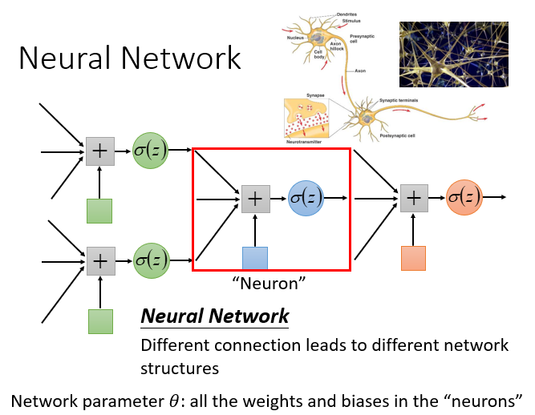
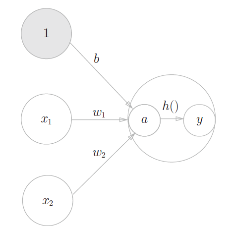
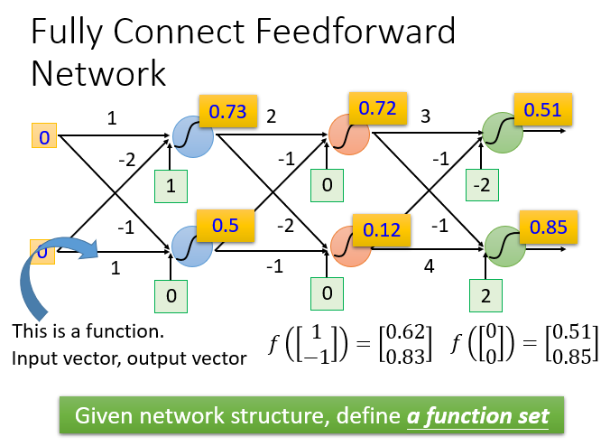
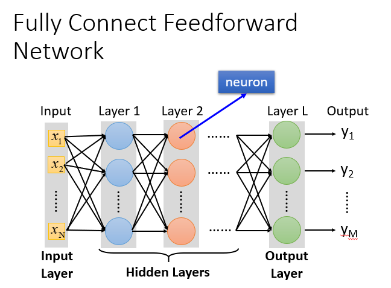
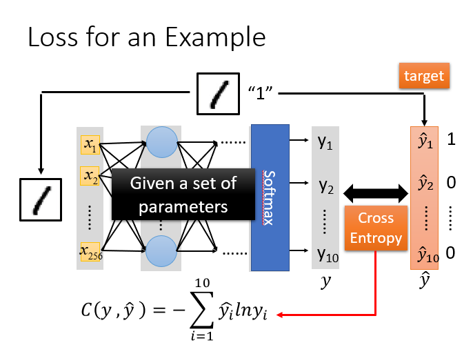

# 神经网络

## 网络构建

神经网络（Neural network）里面的节点，类似我们的神经元，从其他节点接受信息，经过处理后传递给其他节点。网络节点之间的连接结构则取决于构建者设计。

### 节点信息处理

一般而言，节点使用先将收到的信息（数据）进行线性处理，然后再通过非线性函数传出。这种处理方式也被称为感知机。线性处理$y = w x + b$中，行向量w称为权重，b称为偏差，非线性函数h称为激活函数。

### 完全连接前馈神经网络

概念：前馈（feedforward）也可以称为前向，从信号流向来理解就是输入信号进入网络后，信号流动是单向的，即信号从前一层流向后一层，一直到输出层，其中任意两层之间的连接并没有反馈（feedback），亦即信号没有从后一层又返回到前一层。

当输入0和0时，则得到0.51和0.85，所以一个神经网络如果权重和偏差都知道的话就可以看成一个函数，他的输入是一个向量，对应的输出也是一个向量。不论是做回归模型（linear model）还是逻辑回归（logistics regression）都是定义了一个函数集（function set）。我们可以给上面的结构的参数设置为不同的数，就是不同的函数（function）。这些可能的函数（function）结合起来就是一个函数集（function set）。这个时候你的函数集（function set）是比较大的，是以前的回归模型（linear model）等没有办法包含的函数（function），所以说深度学习（Deep Learning）能表达出以前所不能表达的情况。

全链接是指相邻前后两层之间两两都有连接，所以叫做Fully Connect；前馈是指传递的方向是由后往前传，所以叫做Feedforward。此时前后两层的运算关系可表示为：

$$ x^{i+1}=\sigma(W_i x + b_i) $$

### 神经网络本质

通过隐藏层进行特征转换。把隐藏层通过特征提取来替代原来的特征工程，这样在最后一个隐藏层输出的就是一组新的特征（相当于黑箱操作）而对于输出层，其实是把前面的隐藏层的输出当做输入（经过特征提取得到的一组最好的特征）然后通过一个多分类器（可以是softmax函数）得到最后的输出y。

## 网络模型评估

对于模型的评估，我们一般采用损失函数来反应模型的好差，所以对于神经网络来说，我们采用交叉熵（cross entropy）函数来对$y$和$\hat{y}​$的损失进行计算，接下来我们就是调整参数，让交叉熵越小越好。

## 网络参数优化

用梯度下降来求解网络最优参数。
具体流程：$\theta$是一组包含权重和偏差的参数集合，随机找一个初试值，接下来计算一下每个参数对应偏微分，得到的一个偏微分的集合$\nabla{L}$就是梯度,有了这些偏微分，我们就可以不断更新梯度得到新的参数，这样不断反复进行，就能得到一组最好的参数使得损失函数的值最小

### 反向传播
