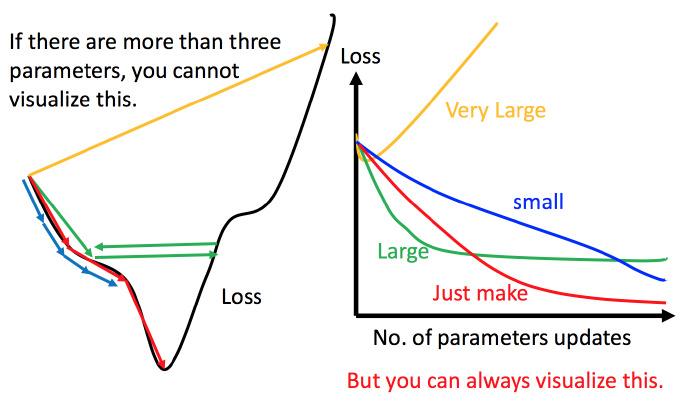

# 梯度下降法

由于给出的训练数据集固定，损失函数只与模型参数有关。所以可对损失函数在参数上的梯度来更新参数。
$$ P_{i+1} = P_{i} - \eta \frac{\partial L}{\partial P}(P_{i}) $$
其中$\eta$称为学习率

## 学习速率

梯度下降法的效果常与设定的学习速率有很大关系。

上图左边黑色为损失函数的曲线，假设从左边最高点开始，如果学习率调整的刚刚好，比如红色的线，就能顺利找到最低点。如果学习率调整的太小，比如蓝色的线，就会走的太慢，虽然这种情况给足够多的时间也可以找到最低点，实际情况可能会等不及出结果。如果，学习率调整的有点大，比如绿色的线，就会在上面震荡，走不下去，永远无法到达最低点。还有可能非常大，比如黄色的线，直接就发散了，更新参数的时候只会发现损失函数越更新越大。所以需要将参数改变对损失函数的影响进行可视化。比如学习率太小（蓝色的线），损失函数下降的非常慢；学习率太大（绿色的线），损失函数下降很快，但马上就卡住不下降了；学习率特别大（黄色的线），损失函数就飞出去了；红色的就是差不多刚好，可以得到一个好的结果。

### 自适应学习率

根据不同情况调整学习速率。

#### AdaGrad 算法

取：

$$ \eta_i = \frac{\eta_0}{\sqrt{\sum^i_{t=0}(\frac{\partial L}{\partial P}(P_{t}))^2}}$$

此时学习速率随下降次数增加而减小，且梯度愈大，减小越快。

## 随机梯度下降法

此时不需要像之前那样对所有的数据进行处理，只需要计算某一个例子的损失函数，就可以更新梯度。

## 梯度下降法的问题

### 近似精度

梯度下降本质是在损失函数某点的局部做线性近似，使用在此点的切平面代替这部分损失函数。所以往往需要在这一点的小范围邻域内才能得到相对好的近似。因此在学习速率较大的时候近似的情况可能不好，甚至不能下降。

### 局部最小值

容易陷入局部极值 还有可能卡在不是极值，但微分值是0的地方 还有可能实际中只是当微分值小于某一个数值就停下来了，但这里只是比较平缓，并不是极值点。

