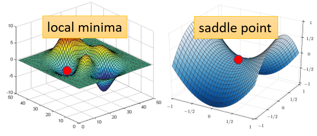

# 临界点

## 临界点分析

临界点，即梯度为0的点，分为两类：局部极值点和鞍点。

由梯度下降法停留在局部极大值的可能性极低，暂不考虑。主要考虑局部极小值和鞍点。若为局部极小值，则梯度下降法难以继续进行；若为鞍点，则四周仍存在较低点，可继续进行。

## 临界点判别

判断方式：将损失函数在此点附近做Tayler展开，得

$$ L(\theta)=L(\theta_0)+(\theta-\theta_0)^Tg+\frac{1}{2}(\theta-\theta_0)^TH(\theta-\theta_0) $$

其中g为梯度$\frac{\partial L}{\partial \theta}(\theta_0)$，H为Hessian矩阵$H_{ij}=\frac{\partial^2 L}{\partial \theta_i\partial \theta_j}(\theta_0)$。

临界点时，g=0，故若H正定，则为局部最小值；若H负定，则为局部最大值；若H不定，则为鞍点。矩阵的正负定情况由其特征值决定，若其特征值皆大于0，则正定；皆小于0则负定；若有正有负则不定。

## 临界点更新

当临界点别判定为鞍点时，可使其沿某一方向更新，从而使损失函数下降。从上述分析可知，欲使$L(\theta)$减小，只需使$(\theta-\theta_0)^TH(\theta-\theta_0)$为负即可。又H有负的特征值$\lambda$，所以可令$(\theta-\theta_0)$为此负特征值对应的某一个特征向量$v$，则
$$(\theta-\theta_0)^TH(\theta-\theta_0)=v^T\lambda v=\lambda||v||^2<0$$
故令$\theta=\theta_0+v$即可。（注：为保证Tayler展开的近似效果，v的取值不能过大）

## 临界点类别出现情况

这边是训练某一个network的结果,每一个点代表,训练那个network训练完之后,把它的Hessian拿出来进行计算,所以这边的每一个点,都代表一个network,就我们训练某一个network,然后把它训练训练,训练到gradient很小,卡在critical point,把那组参数出来分析,看看它比较像是saddle point,还是比较像是local minima

​所以从经验上看起来,其实local minima并没有那麼常见,多数的时候,你觉得你train到一个地方,你gradient真的很小,然后所以你的参数不再update了,往往是因為你卡在了一个saddle point。
