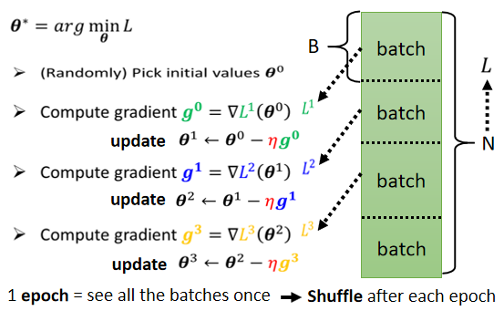
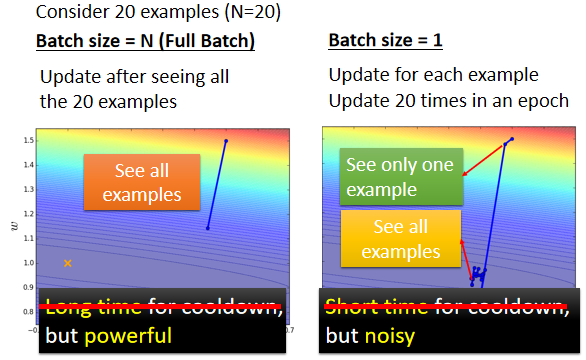
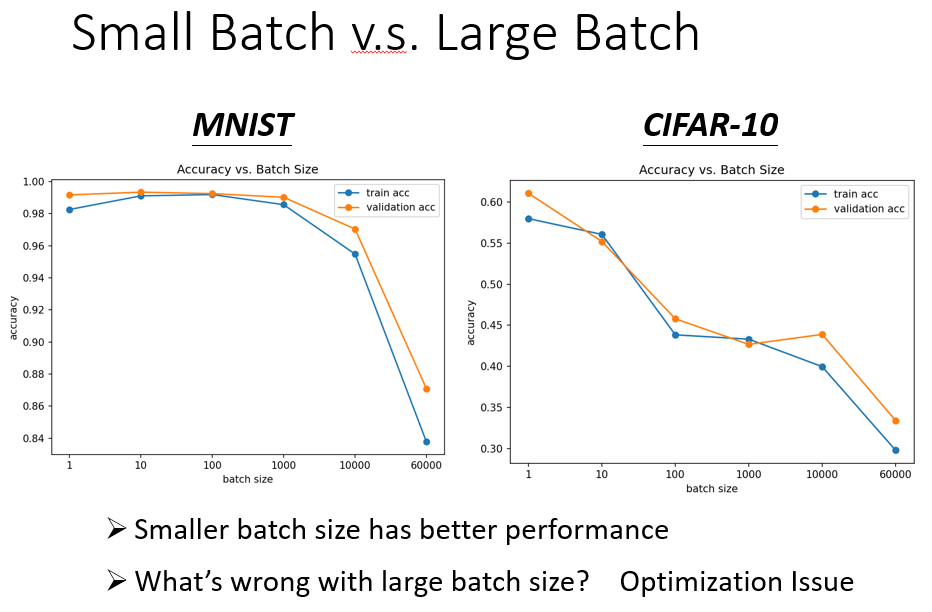
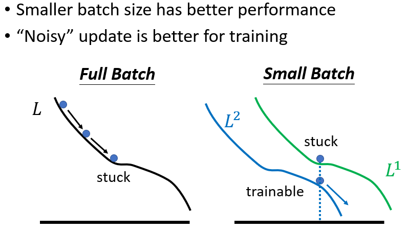
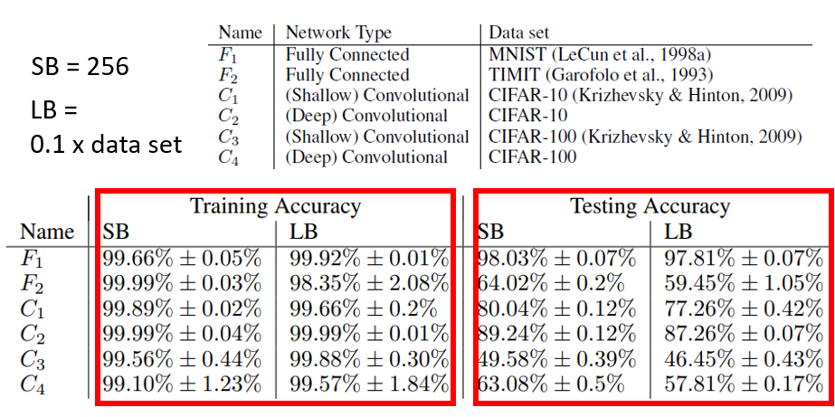
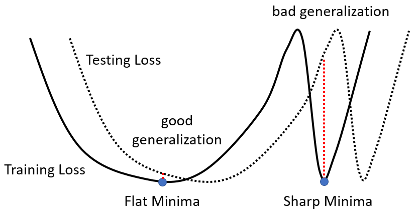
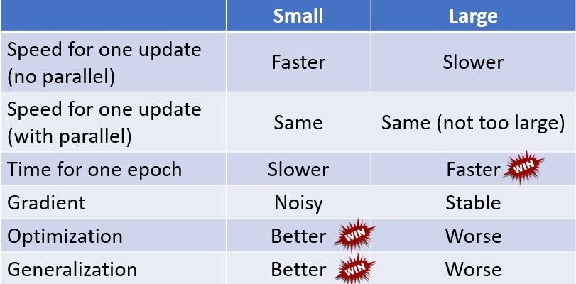

# 分批梯度下降法

实际上在算微分的时候，并不是真的对所有数据算出来的损失函数作微分，而是把所有的数据分成一个一个的批次。

每一个批次，就是数量为B的一笔的资料。每次在更新参数时只使用某个批次计算损失函数和梯度，并以此更新参数；然后再使用另一个批次，以此类推。所有的批次看过一遍，称为一个Epoch。在每个Epoch后需要进行Shuffle。Shuffle有很多不同的做法，但一个常见的做法是，在每一个 Epoch 开始之前，会分一次 Batch，然后呢，每一个 Epoch 的 Batch 都不一样，就是第一个 Epoch，分这样子的 Batch，第二个 Epoch，会重新再分一次 Batch，所以哪些资料在同一个 Batch 里面，每一个 Epoch 都不一样的这件事情，叫做 Shuffle。

## 小批次和大批次

​左边没有分批的方式，它蓄力的时间比较长，还有它技能冷却的时间比较长，要把所有的资料都看过一遍，才能够 Update 一次参数。而右边Batch Size 等于1的时候，蓄力的时间比较短，每次看到一笔参数，每次看到一笔资料，就会更新一次的参数。​所以假设有20笔资料，看完所有资料看过一遍，已经更新了20次的参数，但是左边这样子的方法有一个优点，就是它这一步走的是稳的，那右边这个方法它的缺点，就是它每一步走的是不稳的

​看起来左边的方法跟右边的方法，他们各自都有擅长跟不擅长的东西，左边是蓄力时间长，但是威力比较大，右边技能冷却时间短，但是它是比较不準的，看起来各自有各自的优缺点，但是会觉得说，左边的方法技能冷却时间长，右边的方法技能冷却时间短，那只是没有考虑并行运算的问题。

## 大批次并不一定时间比较长

在实际上做运算的时候，有 GPU，可以做并行运算，是因为可以做平行运算的关係，这1000笔资料是平行处理的，所以1000笔资料所花的时间，并不是一笔资料的1000倍，当然 GPU 平行运算的能力还是有它的极限，当的 Batch Size 真的非常非常巨大的时候，GPU 在跑完一个 Batch，计算出 Gradient 所花费的时间，还是会随著 Batch Size 的增加，而逐渐增长。

​因为有平行运算的能力，因此实际上，当 Batch Size 小的时候，要跑完一个 Epoch，花的时间是比大的 Batch Size 还要多的。​如果假设的训练资料只有60000笔，那 Batch Size 设1，那要60000个 Update 才能跑完一个 Epoch，如果是 Batch Size 等于1000，要60个 Update 才能跑完一个 Epoch，假设一个 Batch Size 等于1000，要算 Gradient 的时间根本差不多，那60000次 Update，跟60次 Update 比起来，它的时间的差距量就非常可观了。

​所以左边这个图是 Update 一次参数，拿一个 Batch 出来计算一个 Gradient，Update 一次参数所需要的时间，右边这个图是，跑完一个完整的 Epoch，需要花的时间，会发现左边的图跟右边的图，它的趋势正好是相反的，假设 Batch Size 这个1，跑完一个 Epoch，要 Update 60000次参数，它的时间是非常可观的，但是假设的 Batch Size 是1000，只要跑60次，Update 60次参数就会跑完一个 Epoch，所以跑完一个 Epoch，看完所有资料的时间，如果的 Batch Size 设1000，其实是比较短的，Batch Size 设1000的时候，把所有的资料看过一遍，其实是比 Batch Size 设1 还要更快

如果看右边这个图的话，看完一个 Batch，把所有的资料看过一次这件事情，大的 Batch Size 反而是较有效率的。在没有考虑平行运算的时候，大的 Batch 比较慢，但实际上，在有考虑平行运算的时候，一个 Epoch 大的 Batch 花的时间反而是比较少的

比较这个 Batch Size 大小的差异，看起来直接用技能时间冷却的长短，并不是一个精确的描述，看起来在技能时间上面，大的 Batch 并没有比较吃亏，甚至还占优势了。​所以事实上，大的 Batch，这个 Update 比较稳定，小的 Batch，它的 Gradient 的方向比较 Noisy 。那这样看起来，大的 Batch 好像应该比较好，小的 Batch 应该比较差，因为现在大的 Batch 的劣势已经，因为平行运算的时间被拿掉了，它好像只剩下优势而已.

## 噪声有利于训练

神奇的地方是 Noisy 的 Gradient，反而可以帮助 Training ，这个也是跟直觉正好相反的。

- 横轴代表的是 Batch Size，从左到右越来越大
- 纵轴代表的是正确率，越上面正确率越高，当然正确率越高越好

​如果看 Validation Acc 上的结果，会发现，Batch Size 越大，Validation Acc 上的结果越差，但这个不是 Overfitting，因为如果看的 Training 的话，会发现说 Batch Size 越大，Training 的结果也是越差的，而现在用的是同一个模型，照理说，它们可以表示的 Function 就是一模一样的。但是神奇的事情是，大的 Batch Size，往往在 Training 的时候，会给带来比较差的结果

​所以这个是什麼样的问题，同样的 Model，所以这个不是 Model Bias 的问题，**这个是 Optimization 的问题，代表当用大的 Batch Size 的时候，的 Optimization 可能会有问题**，小的 Batch Size，Optimization 的结果反而是比较好的。

​为什么小的 Batch Size，在 Training Set 上会得到比较好的结果，为什么 Noisy 的 Update，Noisy 的 Gradient 会在 Training 的时候，给比较好的结果呢？一个可能的解释是这样子的：

​假设是 Full Batch，那在 Update 的参数的时候，就是沿著一个 Loss Function 来 Update 参数， Update 参数的时候走到一个 Local Minima，走到一个 Saddle Point，显然就停下来了，Gradient 是零，如果不特别去看Hession的话，那用 Gradient Descent 的方法，就没有办法再更新的参数了

​但是假如是 Small Batch 的话，因为每次是挑一个 Batch 出来，算它的 Loss，所以等于是，等于每一次 Update 的参数的时候，用的 Loss Function 都是越有差异的，选到第一个 Batch 的时候，是用 L1 来算的 Gradient，选到第二个 Batch 的时候，是用 L2 来算的 Gradient，假设用 L1 算 Gradient 的时候，发现 Gradient 是零，卡住了，但 L2 它的 Function 跟 L1 又不一样，L2 就不一定会卡住，所以 L1 卡住了 没关係，换下一个 Batch 来，L2 再算 Gradient。

​还是有办法 Training 的 Model，还是有办法让的 Loss 变小，所以这种 Noisy 的 Update 的方式，结果反而对 Training，其实是有帮助的。

## 噪声有利于泛化

假设有一些方法，把大的 Batch，跟小的 Batch 训练得一样好，结果发现**小的 Batch，在 Testing 的时候仍表现更好**。以下实验结果是引用自：On Large-Batch Training For Deep Learning，Generalization Gap And Sharp Minima<https://arxiv.org/abs/1609.04836>。

​这篇文章中，作者训练了六个网络，包含 CNN 和 Fully Connected Network ，在不同的 Cover 上，来代表这个实验的泛用性强，在很多不同的情况下都观察到一样的结果。就算是在训练时，结果差不多，Testing 时还是发现，小的 Batch 比大的 Batch 差。Training 的时候都很好，Testing 的时候大的 Batch 差，代表**Over Fitting**。为什么会有这样子的现象呢？在这篇文章里面也给出了一个解释：

​假设这个是 Training Loss，其上有多个 Local Minima，且这些 Local Minima 的 Loss 都很低，趋近于 0。但是这个 **Local Minima，有好 Minima 跟坏 Minima 之分**。​如果一个 Local Minima 在一个峡谷里面，它是坏的 Minima，然后它在一个平原上，它是好的 Minima。为什么会有这样的差异呢
 
- 假设在 Training 跟 Testing 中间，有一个 Mismatch，Training 的 Loss 跟 Testing 的 Loss，它们那个 Function 不一样，有可能是本来 Training 跟 Testing 的 Distribution就不一样。
- 那也有可能是因为 Training 跟 Testing，都是从 Sample 的 Data 算出来的，也许 Training 跟 Testing，Sample 到的 Data 不一样，那所以它们算出来的 Loss，当然是有一点差距。

​假设 Training 跟 Testing，的差距就是把 Training 的 Loss，这个 Function 往右平移一点。这时候会发现，对左边在一个盆地里面的 Minima 来说，它的在 Training 跟 Testing 上面的结果，不会差太多，只差了一点点，但是对右边这个在峡谷里面的 Minima 来说，一差就可以天差地远。

​它在这个 Training Set 上，算出来的 Loss 很低，但是因为 Training 跟 Testing 之间的不一样，所以 Testing 的时候，这个 Error Surface 一变，它算出来的 Loss 就变得很大，而很多人相信这个**大的 Batch Size，会让倾向于走到峡谷里面，而小的 Batch Size，倾向于让走到盆地里面**

​直觉上的想法是：小的 Batch 有很多的 Loss，每次 Update 的方向随机性较大。如果这个峡谷非常地窄，可能一个不小心就跳出去了，没有办法困住小的 Batch；如果有一个非常宽的盆地，它才会停下来。对于大的 Batch Size，顺著规定 Update，很有可能走到一个比较小的峡谷里面。​但这只是一个解释，也不是每个人都相信这个解释，这其实还是一个**尚待研究的问题**

## 总结

在有平行运算的情况下，小的 Batch 跟大的 Batch，运算的时间并没有太大的差距，除非的大的 Batch 那个大是真的非常大，才会显示出差距来。但是一个 Epoch 需要的时间，小的 Batch 比较长，大的 Batch 反而是比较快的，所以从一个 Epoch 需要的时间来看，大的 Batch 其实是占优势的。

​而小的 Batch， Update 的方向比较 Noisy，大的 Batch Update 的方向比较稳定，但是 Noisy 的 Update 的方向，反而在 Optimization 的时候会占优势，而且在 Testing 的时候也会占优势，所以大的 Batch 跟小的 Batch，它们各自有它们擅长的地方
所以**Batch Size，变成另外一个需要调整的 Hyperparameter**。

​能不能够截取大的 Batch 的优点，跟小的 Batch 的优点，用大的 Batch Size 来做训练，用平行运算的能力来增加训练的效率，但是训练出来的结果同时又得到好的结果呢，又得到好的训练结果呢。参考文献：

- Large Batch Optimization for Deep Learning: Training BERT in 76 minutes (<https://arxiv.org/abs/1904.00962>)
- Extremely Large Minibatch SGD: Training ResNet-50 on lmageNet in 15 Minutes (<https://arxiv.org/abs/1711.04325>)
- Stochastic Weight Averaging in Parallel: Large-Batch Training That Generalizes Well (<https://arxiv.org/abs/2001.02312>)
- Large Batch Training of Convolutional Networks (<https://arxiv.org/abs/1708.03888>)
- Accurate, large minibatch sgd: Training imagenet in 1 hour (<https://arxiv.org/abs/1706.02677>)
