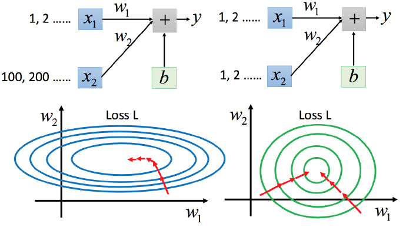

# 数据预处理

原始数据往往需要经过一些预处理，使其在尽可能保留信息的情况下，更加利于算法求解。

## 特征缩放

比如有个函数：

$$y=b+w_1x_1+w_2x_2 \tag{12}$$
两个输入的分布的范围很不一样，建议把他们的范围缩放，使得不同输入的范围是一样的。

### 为什么要这样做？

上图左边是 $x_1$ 的scale比 $x_2$ 要小很多，所以当 $w_1$ 和 $w_2$ 做同样的变化时，$w_1$ 对 $y$ 的变化影响是比较小的，$x_2$ 对 $y$ 的变化影响是比较大的。

坐标系中是两个参数的error surface（现在考虑左边蓝色），因为 $w_1$ 对 $y$ 的变化影响比较小，所以 $w_1$ 对损失函数的影响比较小，$w_1$ 对损失函数有比较小的微分，所以 $w_1$ 方向上是比较平滑的。同理 $x_2$ 对 $y$ 的影响比较大，所以 $x_2$ 对损失函数的影响比较大，所以在 $x_2$ 方向有比较尖的峡谷。

上图右边是两个参数scaling比较接近，右边的绿色图就比较接近圆形。

对于左边的情况，上面讲过这种狭长的情形不过不用Adagrad的话是比较难处理的，两个方向上需要不同的学习率，同一组学习率会搞不定它。而右边情形更新参数就会变得比较容易。左边的梯度下降并不是向着最低点方向走的，而是顺着等高线切线法线方向走的。但绿色就可以向着圆心（最低点）走，这样做参数更新也是比较有效率。

### 怎么做缩放？

方法非常多，这里举例一种常见的做法：

上图每一列都是一个例子，里面都有一组特征。

对每一个维度 $i$（绿色框）都计算平均数，记做 $m_i$；还要计算标准差，记做 $\sigma_i$。

然后用第 $r$ 个例子中的第 $i$ 个输入，减掉平均数 $m_i$，然后除以标准差 $\sigma_i$，得到的结果是所有的维数都是 $0$，所有的方差都是 $1$
