# 卷积神经网络

卷积神经网络(Convolutional Neural Network，CNN)，常用于图像处理和与之相似度高的方面。其设计过程可带来不少对设计神经网络架构的启发。

## 图像分类简介

图像分类任务是由机器从一张图片中识别出其中包含的物体，如猫、狗之类的。由于神经网络输入大小固定，所以也需要先将不同大小的图片使用图像处理的算法使其缩放至指定大小，再输入网络处理。模型的目标是分类，所以会把每一个类别表示成一个 One-Hot 的 Vector，我的目标就叫做 $\hat{y}$。在这个 One-Hot 的 Vector 中，假设类别是猫的话，猫所对应的 Dimension 数值就是 1，其他东西所对的 Dimension 数值就是 0。这个 Dimension 的长度就决定了，现在的模型可以辨识出多少不同种类的东西。

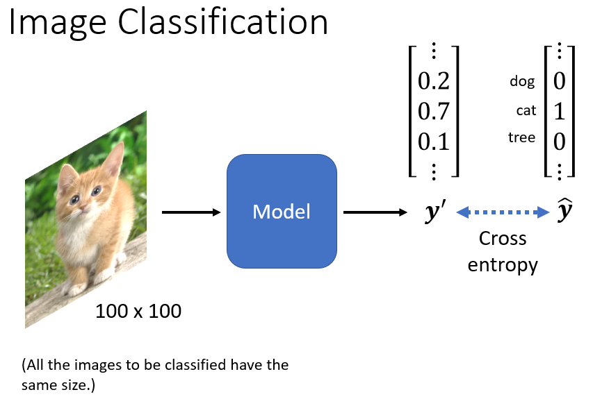

模型的输出通过 Softmax 以后，输出是 $y'$。希望 $y'$ 和$\hat{y}$的 Cross Entropy 越小越好，接下来的问题怎么**把一张影像当做一个模型的输入**。

对于一个 Machine 来说，一张图片其实是一个**三维的 Tensor**，其中一维代表图片的**宽**，另外一维代表图片的**高**，还有一维代表图片的 **Channel 的数目**。一张彩色的图片，它每一个 Pixel，都是由 R G B 三个顏色所组成的，所以这三个 Channel 就代表了 R G B 三个顏色，长跟宽就代表代表这张图片中的像素（Pixel）的数目。

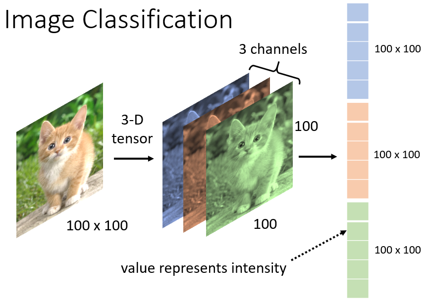

 Network 的输入是一个向量，所以只要能够把一张图片变成一个向量，就可以把它当做是 Network 的输入。最直觉的方法就是直接拉直它。

在这个例子中有 100 × 100 × 3 个数字，拿出来排成一排，就是一个巨大的向量，可以作為 Network 的输入。每一个 Neuron 跟输入向量的每一个数值都会有一个 Weight，所以如果输入的向量长度是 100 × 100 × 3，有 1000 个 Neuron，那第一层的 Weight，就有 1000 × 100 × 100 × 3，也就是 $3×10^7$，是一个非常巨大的数目。

虽然随著参数的增加，可以增加模型的弹性，可以增加它的能力，但是也增加了 **Overfitting** 的风险（参考内容：吴培元老师<https://speech.ee.ntu.edu.tw/~hylee/ml/ml2021-course-data/W14_PAC-introduction.pdf>，概念上，如果模型的弹性越大，就越容易 Overfitting ）。

怎么减少在做影像辨识的时候怎么避免使用这麼多的参数呢。考虑到影像辨识这个问题本身的特性，其实并**不一定需要 Fully Connected** 这件事。不需要每一个 Neuron，跟 Input 的每一个 Dimension 都有一个 Weight。

## 图像特征识别

### 观察

第一个观察是，对影像辨识这个问题而言，假设想要知道这张图片中有一隻动物，这个动物是一个鸟，怎么做呢。也许对一个影像辨识的系统而言，对一个影像辨识的类神经网路中的神经而言，它要做的就是侦测现在这张图片中，有没有出现一些特别重要的 Pattern。

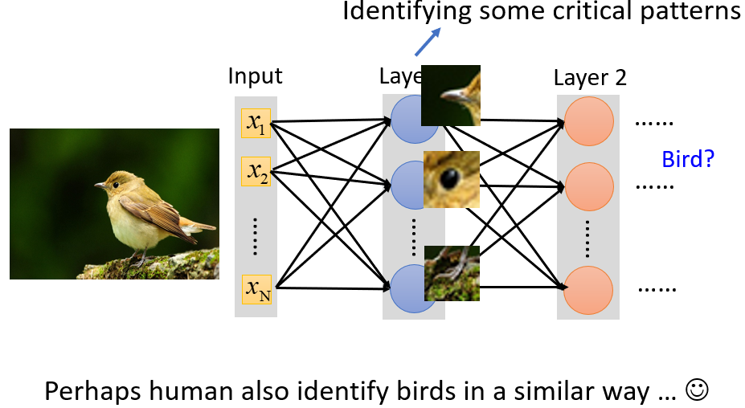

举例：

- 某个 Neuron 看到鸟嘴这个 Pattern
- 某个 Neuron 看到眼睛这个 Pattern
- 某个 Neuron 看到鸟爪这个 Pattern

也许看到这些 Pattern 综合起来就代表看到了一隻鸟，类神经网路就可以告诉你说，因為看到了这些 Pattern，所以它看到了一隻鸟。**类比人类**识别物体过程，也是用同样的方法来看一张图片中有没有一隻鸟。在判断一个物件的时候，往往也是抓最重要的特徵，在看到这些特徵以后，你很就会觉得看到了某种物件。对机器来说，也许这也是一个有效的，判断影像中有什麼物件的方法。

假设用 Neuron 做的事情，就是判断现在有没有某种 Pattern 出现，那也许并**不需要每一个 Neuron 都去看一张完整的图片**。因為这一些重要的 Pattern，比如说鸟嘴、眼睛、鸟爪，不需要在看整张完整的图片后，才能够得到，所以**这些 Neuron 也许根本就不需要把整张图片当作输入**。它们只需要把图片的一小部分当作输入，就足以让它们侦测某些特别关键的 Pattern有没有出现了。

### 化简

在 CNN 中有一个这样的做法，会设定一个区域叫做 Receptive Field ，**每一个 Neuron 都只关心自己的 Receptive Field 中发生的事情**。

举例来说 先定义说这个**蓝色的 Neuron**，它的守备范围就是这一个 Receptive Field。对蓝色的 Neuron 来说，它只需要关心这一个小范围就好了，不需要在意整张图片裡面有什麼东西。它要做的事情就是：

1. 把这 3×3×3 的数值**拉直**，变成一个长度是 3×3×3 也就是 27 维的向量，再把这 27 维的向量作為这个 Neuron 的输入
2. 这个 Neuron 会给 27 维的向量的，**每一个 Dimension 一个 Weight**，所以这个 Neuron 有 3×3×3  27个 Weight，
3. 再**加上 Bias** 得到的输出，这个输出再送给下一层的 Neuron 当作输入，

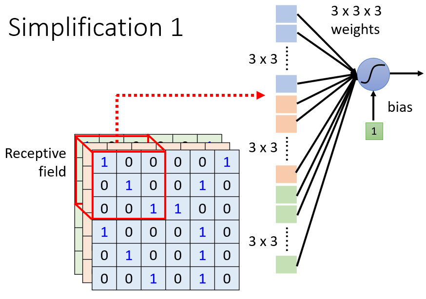

Receptive Field 的决定方式完全取决于设计者。

Receptive Field 彼此之间也可以**重叠**的。比如说我现在画一个 Receptive Field，那这个地方它是绿色的 Neuron 的守备范围，它跟蓝色的跟黄色的都有一些重叠的空间。甚至可以两个不同的 Neuron，它们守备看到的范围**相同**，也许一个范围使用一个 Neuron 来守备，没有办法侦测所有的 Pattern，所以同个范围可以有多个不同的 Neuron。

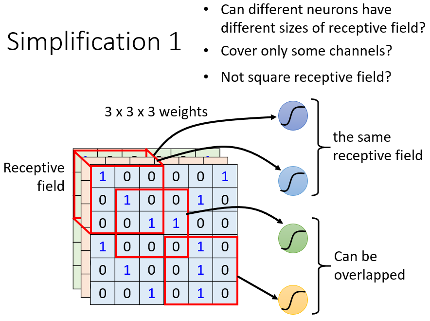

各式各样的想法举例：

- 可不可以 Receptive Field **有大有小**呢？因為毕竟 Pattern 有的比较小有的比较大，有的 Pattern 也许在 3×3 的范围内，就可以被侦测出来，有的 Pattern 也许要 11×11 的范围，才能被侦测出来。可以，这个算是常见的招式了
- 可不可以 Receptive Field，**只考虑某些 Channel** 呢？我们这边看起来我们的 Receptive Field，是 R G B 三个 Channel 都考虑，但也许有些 Pattern，只在红色的 Channel 会出现，也许有些 Pattern，只在蓝色的 Channel 会出现，可不可以有的 Neuron 只考虑一个 Channel 呢？可以，在 Network Compression 中，有这种 Network 的架构，在一般 CNN 裡面不常这样子的考虑，但是有这样子的做法
- 可不可以 Receptive Field 是**长方形**？可以，这完全都是你自己设计的，Receptive Field 是你自己定义的，你完全可以根据你对这个问题的理解，决定你觉得 Receptive Field 应该要长什麼样子
- 可不可以 Receptive Field **不相连**。**理论上**可以，但是你就要想看為什麼要这麼做，会不会有什麼 Pattern 要看一个图片的左上角跟右下角才能够找到的。如果没有的话，这种 Receptive Field 就没什麼用。之所以 Receptive Field 都是一个相连的领地，就是我们觉得要侦测一个 Pattern，它出现在整个图片裡面的某一个位置，而不是分成好几部分，在图片裡面的不同的位置，所以通常见到的 Receptive Field 都是相连的领地

如果要设计**很奇怪的 Receptive Field，去解决很特别的问题**，那完全是可以的，这都是你自己决定的

### 典型设计

虽然 Receptive Field 可以任意设计，但也有最经典的 Receptive Field 的安排方式：

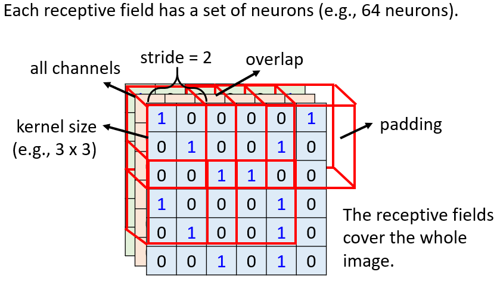

#### 看所有的 Channel

一般在做影像辨识的时候，不会觉得有些 Pattern 只出现某一个 Channel 裡面，所以会看全部的 Channel，所以既然会看全部的 Channel ，在描述一个 Receptive Field 的时候，**只要讲它的高跟宽就好**了，就不用讲它的深度，反正**深度一定是考虑全部的 Channel**，而这个高跟宽合起来叫做 *Kernel Size*。在这个例子裡面， Kernel Size 就是 3×3。一般 Kernel Size 不会设太大， 7×7  9×9，这算是蛮大的 Kernel Size。

可能会有人疑问那如果 Kernel Size 都是 3×3，意味著说我们觉得在做影像辨识的时候，重要的 Pattern 都只在 3×3 这麼小的范围内，就可以被侦测出来了，听起来好像怪怪的，有些 Pattern 也许很大啊，也许 3×3 的范围没办法侦测出来啊

等一下我们会再回答这个问题，那我现在先告诉你说，常见的 Receptive Field 设定方式，就是 Kernel Size 3×3，然后**一般同一个 Receptive Field，不会只有一个 Neuron 去关照它，往往会有一组 一排 Neuron 去守备它**，比如说 64 个 或者是 128 个 Neuron 去守备一个 Receptive Field 的范围，

#### 感知区域定量平移

把最左上角的这个 Receptive Field，往右移一点，然后製造一个另外一个 Receptive Field，这个移动的量叫做*Stride*。在这个例子裡面 Stride = 2， Stride 是一个你自己决定的 **Hyperparameter**，但这个 Stride 往往不会设太大，1 或 2 就可以了。

因為希望这些 Receptive Field，跟 Receptive Field 之间是有重叠的，因為假设 Receptive Field 完全没有重叠，那有一个 Pattern 就正好出现，在两个 Receptive Field 的交界上面，那就会变成没有任何 Neuron 去侦测它，那你也可能就会 Miss 掉这个 Pattern，所以我们希望 Receptive Field 彼此之间，有高度的重叠

除了这个横著移动，你也会这个直著移动，你有会有这个垂直方向上的移动。所以整张图片裡面，每一吋土地都是有被某一个Receptive Field 覆盖的，也就是**图片裡面每一个位置，都有一群 Neuron 在侦测**那个地方，有没有出现某些 Pattern

#### 超出补足

再往右移两格就放在这边，那这边就遇到一个问题了，它**超出了影像的范围**怎么办呢。那有人可能会说，那就不要在这边摆 Receptive Field，但你这样就漏掉了影像的边边的地方啊，如果有个 Pattern 就在边边的地方，你就没有 Neuron 去关照那些 Pattern啦，没有 Neuron 去侦测出现在边边的 Pattern 了，所以一般边边的地方也会考虑的，但超出范围了怎么办呢。超出范围你就做 ==**Padding**==，**Padding 就是补 0**，好 所以如果你今天 Receptive Field 有一部分，超出影像的范围之外了，那就当做那个裡面的值都是 0

其实也有**别的补值的方法，Padding 就是补值的意思**，比如说有人会说，我这边不要补 0 好不好，我补整张图片裡面所有 Value 的平均，或者你说，我把边边的这些数字拿出来补，有各种不同的 Padding 的方法

## 特征位置不定

### 观察

第二个观察是，**同样的 Pattern，可能会出现在图片的不同区域裡面**，

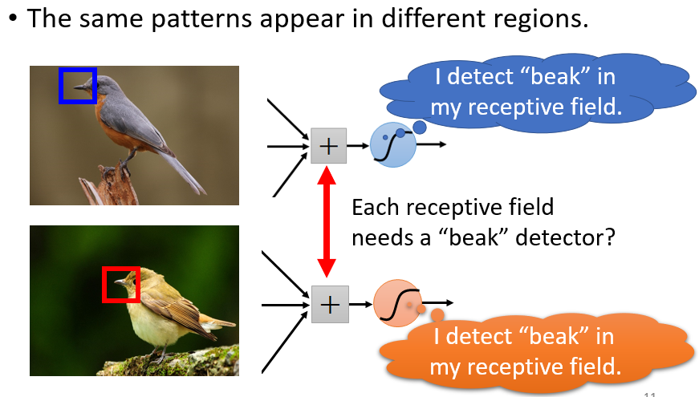

比如说鸟嘴这个 Pattern，它可能出现在图片的左上角，也可能出现在图片的中间，虽然它们的形状都是一样的 都是鸟嘴，但是它们可能出现在图片裡面的不同的位置。

按照刚才的讨论，同样的 Pattern，出现在图片的不同的位置，似乎也不是太大的问题，因為出现在左上角的鸟嘴，它一定落在某一个 Receptive Field 裡面，假设在那个 Receptive Field 裡面，有一个 Neuron 它的工作，就是侦测鸟嘴的话，那鸟嘴就会被侦测出来。所以就算鸟嘴出现在中间，也没有关係。

但问题是，这些侦测鸟嘴的 Neuron，做的事情其实是一样的，只是守备的范围是不一样，**我们真的需要每一个守备范围，都去放一个侦测鸟嘴的 Neuron 吗**？如果不同的守备范围，都要有一个侦测鸟嘴的 Neuron，那你的参数量不会太多了吗？

### 化简

放在影像处理上，可以让不同 Receptive Field 的 Neuron 共享参数 *Parameter Sharing*，即让多个 Neuron 的 weights完全一样。

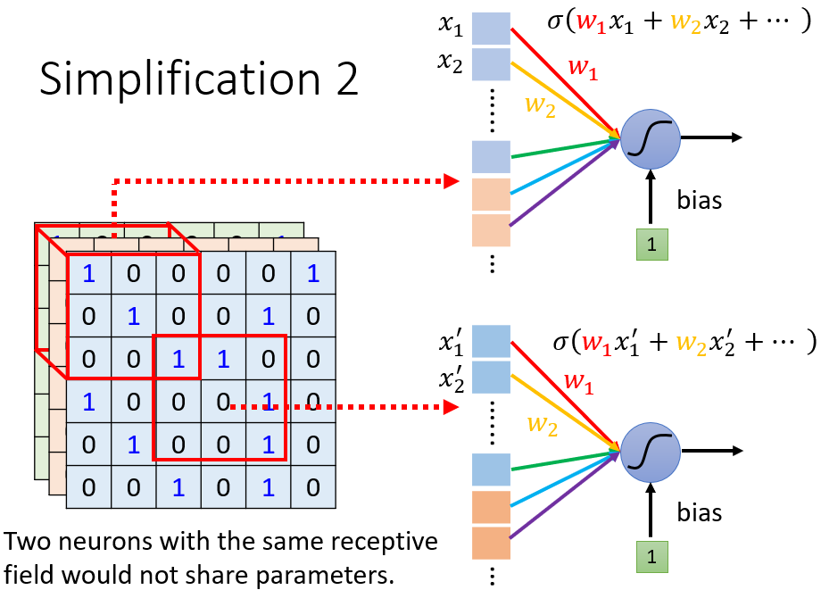

上面这个 Neuron 的第一个 weight，叫做 w1，下面这个 Neuron 的第一个 weight 也是 w1，它们是同一个 weight，用红色表示；上面这个 Neuron 的第二个 weight 是 w2，下面这个 Neuron 的第二个 weight 也是w2，都用黄色来表示，以此类推。上面这个 Neuron 跟下面这个 Neuron，它们**守备的 Receptive Field 是不一样的**，所以它们的**输入是不一样**的，即使这两个 Neuron 的**参数一模一样**，但是它们**输出是不一样**的。

- 上面这个 Neuron，我们说它的输入是 $x_1， x_2$，下面这个 Neuron它的输入是$x_1' ， x_2'$，
- 上面这个 Neuron 的输出就是，x1 × w1 + x2 × w2，全部加加加 再加 Bias，然后透过 Activation Function 得到输出
    $$
    \sigma(w_1x_1+w_2x_2+……)
    $$
- 下面这个 Neuron 虽然也有 w1 w2，但 w1 跟 w2 是乘以 x1' x2'，所以它的**输出不会跟上面这个 Neuron 一样**
    $$
    \sigma(w_1x_1'+w_2x_2'+……)
    $$

所以两个 Neuron 守备的范围不一样，就算它们的参数一样，它们的输出也不会是一样的，所以这是第二个简化

### 典型设计

 Neuron 共享参数的方式由设计者自己决定，常见的在影像辨识上面的共享的方法：

那我们刚才已经讲说，每一个 Receptive Field，它都有一组 Neuron 在负责守备。比如说 64 个 Neuron，所以这个 Receptive Field有 64 个 Neuron，这个 Receptive Field 也有 64 个 Neuron，那它们彼此之间会怎么共享参数呢

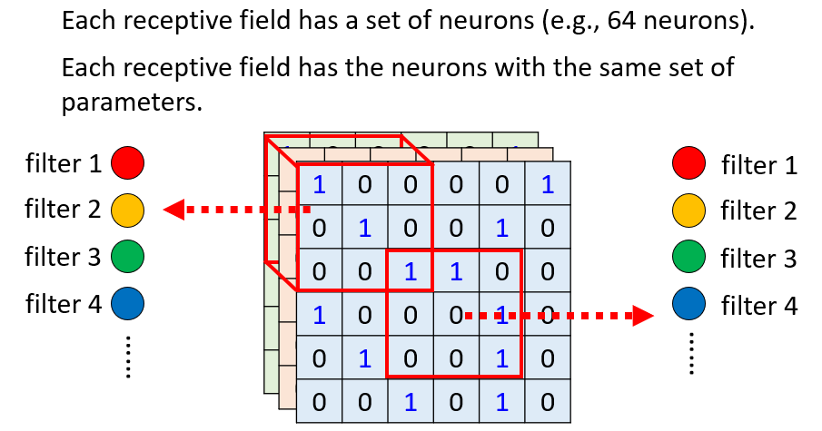

我们这边用一样的顏色，就代表说这两个 Neuron，共享一样的参数，所以其实**每一个 Receptive Field都只有一组参数而已**，就是

- 左上边这个 Receptive Field 的第一个红色 Neuron，会跟右下边这个 Receptive Field 的第一个 红色Neuron 共用参数
- 它的第二个橙色 Neuron，跟它的第二个 橙色Neuron 共用参数
- 它的第三个绿色Neuron，跟它的第三个绿色 Neuron 共用参数
- 所以每一个 Receptive Field，都只有一组参数而已

那这些参数有一个名字，叫做 *Filter*，分别代表对某种特征的过滤器。这两个红色 Neuron，它们共用同一组参数，这组参数就叫 Filter1，橙色这两个 Neuron 它们共同一组参数，这组参数就叫 Filter2 叫 Filter3 叫 Filter4，以此类推。

## 简化总结

目前已经讲了两个简化的方法，那我们来整理一下我们学到了什麼

1. Fully Connected Network

    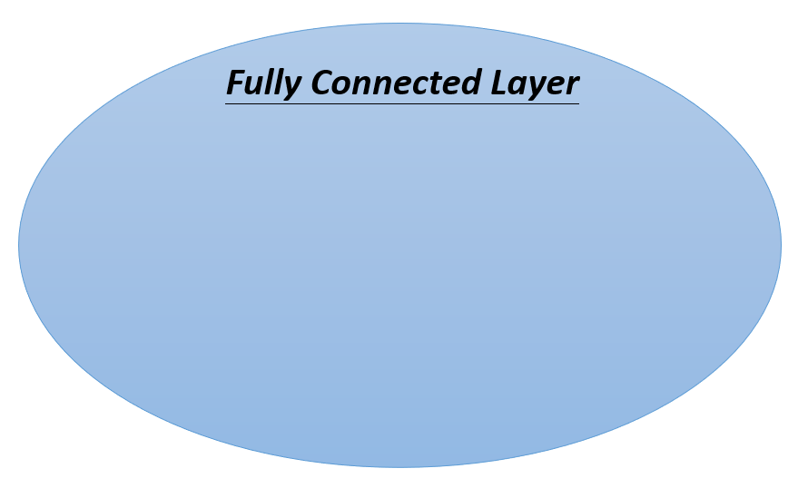

    **弹性最大**的，但有时候不需要看整张图片，也许只要看**图片的一小部分**就可以侦测出重要的 Pattern，所以有了 **Receptive Field** 的概念。

2. Receptive Field

    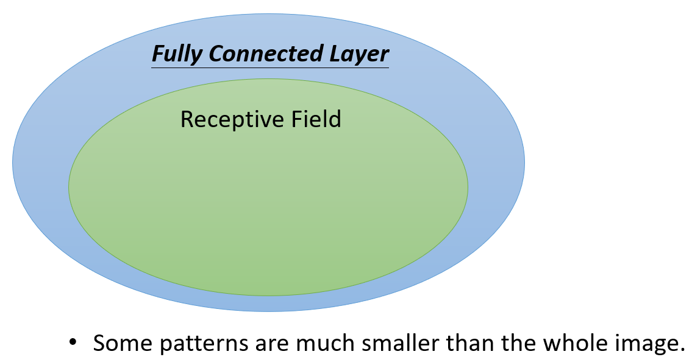

    当我们强制一个 Neuron只能看一张图片裡面的一个范围的时候，它的**弹性是变小**的，如果是 Fully Connected 的 Network，它可以决定看整张图片，还是只看一个范围，就如果它只想看一个范围，就把很多 Weight 设成 0，就只看一个范围，所以加入 Receptive Field 以后，你的 Network 的弹性是变小的

3. 权值共享

    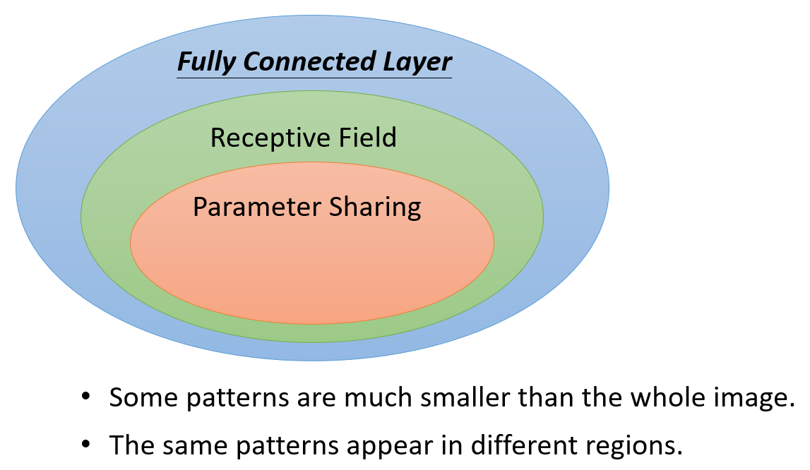

    更进一步限制了 Network 的弹性，本来在 Learning 的时候，它可以决定这两个 Network 的参数要是什麼，每一个 Neuron 可以各自有不同的参数，它们可以正好学出一模一样的参数，也可以有不一样的参数。但是加入参数共享以后，就意味著说 某一些 Neuron参数要一模一样，所以这又更增加了对 Neuron 的限制，而 **Receptive Field 加上 Parameter Sharing，就是 *Convolutional Layer***

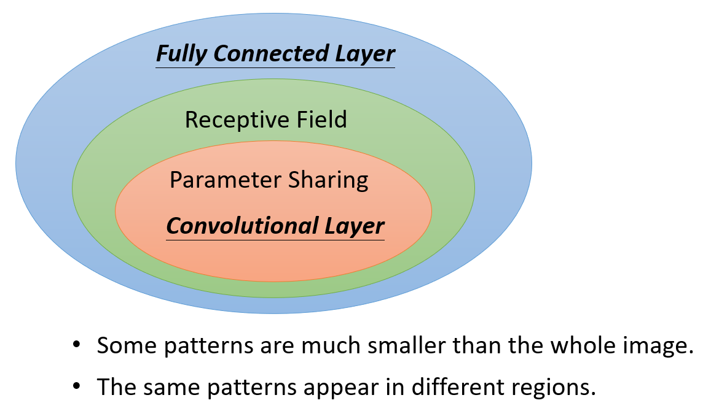

有用到 Convolutional Layer 的 Network，就叫 Convolutional Neural Network，就是 CNN，所以从这个图上啊，你可以很明显地看出，其实 **CNN 的 Bias 比较大，它的 Model 的 Bias 比较大**。但 Model Bias 大，不一定是坏事

- 因為当 **Model Bias 小，Model 的 Flexibility 很高**的时候，它比较**容易 Overfitting**，Fully Connected Layer可以做各式各样的事情，它可以有各式各样的变化，但是它可能没有办法在，任何特定的任务上做好
- 而 Convolutional Layer，它是专门為影像设计的，刚才讲的 Receptive Field 参数共享，这些观察 都是為影像设计的，所以它在影像上仍然可以做得好，虽然它的 Model Bias 很大，但这个在影像上不是问题，但是如果它用在影像之外的任务，你就要仔细想想，那些任务有没有我们刚才讲的，影像用的特性

## 卷积层

另外一种介绍方式：**Convolutional 的 Layer 就是裡面有很多的 Filter**。

这些 Filter 啊 它们的大小是，3 × 3 × Channel 的 Size，如果今天是彩色图片的话，那就是 RGB 三个 Channel，如果是黑白的图片的话，它的 Channel 就等於 1

**一个 Convolutional 的 Layer 裡面就是有一排的 Filter**，每一个 Filter ，它都是一个 3 × 3 × Channel，这麼大的 Tensor

**每一个 Filter 的作用就是要去图片裡面某一个 Pattern**，当然这些 Pattern，要在 3 × 3 × Channel，那麼小的范围内啦，它才能够被这些 Filter 抓出来

那这些 Filter，怎么去图片裡面抓 Pattern 的呢，我们现在举一个实际的例子

 

例子裡面，我们假设 Channel 是 1，也就是说我们图片是**黑白的图片**

那我们假设这些 Filter 的参数是已知的，Filter 就是一个一个的 Tensor，这个 Tensor 裡面的数值，我们都已经知道了，那实际上这些 Tensor 裡面的数值，其实就是 Model 裡面的 Parameter，这些 Filter 裡面的数值，**其实是未知的，它是要透过gradient decent去找出来的**

那我们现在已经假设这些 Filter 裡面的数值已经找出来了，我们来看看说这些 Filter，是怎么跟一张图片进行运作，怎么去图片上面把 Pattern 侦测出来的

这是我们的图片，它是一个 6 × 6 的大小的图片，那这些 Filter的做法就是，先把 Filter 放在图片的左上角，然后**把 Filter 裡面所有的值，跟左上角这个范围内的 9 个值做相乘**，也就是把这个 Filter 裡面的 9 个值，跟这个范围裡面的 9 个值呢，做 Inner Product，做完是 3

==注意！在此处卷集运算中，老师讲的**内积**，**不要理解为**线性代数中**矩阵的乘法**，而是**filter**跟**图片对应位置**的数值**直接相乘**，所有的都乘完以后**再相加**==

老师用的filter为$\begin{bmatrix}
1&-1&-1\\
-1&1&-1\\
-1&-1&1\\
\end{bmatrix}$  与图片的第一个$3\times3$矩阵$\begin{bmatrix}
1&0&0\\
0&1&0\\
0&0&1\\
\end{bmatrix}$ 做卷积运算的过程为

$(1\times1)+(-1\times0)+(-1\times0)+(-1\times0)+(1\times1)+(-1\times0)+(-1\times0)+(-1\times0)+(1\times1)=3$

在下图中 filter为$\begin{bmatrix}
1&0&1\\
0&1&0\\
1&0&1\\
\end{bmatrix}$  大家可以自行验证

接下来这个 Filter 呢，本来放在左上角，接下来就往右移一点，那这个移动的距离叫做 ==Stride==

那在刚才讲前一个版本的故事的时候，我们的 Stride 是设 2，那在这个版本的故事裡面，我们 Stride 就设為 1，那往右移一点，然后再把这个 Filter，跟这个范围裡面的数值，算 Inner Product 算出来是 -1 

然后就以此类推，再往右移一点 再算一下，然后这边全部扫完以后，就往下移一点 再算一下，以此类推，一直到把这个 Filter 放在右下角，算出一个数值，答案就是 -1 就这样

这个 Filter 怎么说它在侦测 Pattern 呢

你看这个 Filter 裡面，它**对角线的地方都是1**，所以它看到 Image 裡面也出现连三个 1 的时候，它的数值会最大

所以你会发现左上角的地方的值最大，左下角的地方的值最大，就告诉我们说，这个图片裡面左上角有出现 3，左上角有出现这个 Pattern，左下角有出现这个，三个 1 连在一起的 Pattern，这个是第一个 Filter

好 那接下来呢，我们把每一个 Filter，都做重复的 Process，比如说这边有第二个 Filter

我们就把第二个 Filter，先从左上角开始扫起，得到一个数值，往右移一点 再得到一个数值，再往右移一点 再得到一个数值，反覆同样的 Process，反覆同样的操作，直到把整张图片都扫完，我们又得到另外一群数值

所以每一个 Filter，都会给我们一群数字，红色的 Filter 给我们一群数字，蓝色的 Filter 给我们一群数字，如果我们有 64 个 Filter，我们就得到 64 群的数字了，那这一群数字啊，它又有一个名字，它叫做 ==Feature Map==

所以当我们把一张图片，通过一个 Convolutional Layer，裡面有一堆 Filter 的时候，我们產生出来了一个 Feature Map

那假设这个 Convolutional Layer裡面，它有 64 个 Filter，那我们產生出来64个 Feature Map，每一组在这个例子裡面是 4 × 4，这个 **Feature Map你可以看成是，另外一张新的图片**

只是这个图片的 Channel 它有 64 个，而且这并不是 RGB 这个图片的 Channel，在这里**每一个 Channel 就对应到一个 Filter**，本来一张图片它三个 Channel，通过一个 Convolution，它变成一张新的图片，有 64 个 Channel

这个 **Convolutional Layer 是可以叠很多层的**，刚才是叠了第一层，那如果叠第二层会发生什麼事呢

**第二层的 Convolution** 裡面，也有一堆的 Filter，那每一个 Filter 呢，它的大小我们这边也设 3 × 3，那**它的高度必须设為 64**

**Filter 的这个高度就是它要处理的影像的 Channel**，所以跟刚才第一层的 Convolution，假设输入的影像是黑白的 Channel是 1，那我们的 Filter 的高度就是 1，输入的影像如果是彩色的 Channel 是 3，那 Filter 的高度就是 3，那在第二层裡面，我们也会得到一张影像，对第二个 Convolutional Layer 来说，它的输入也是一张图片，那这个图片的 Channel 是多少，这个图片的 Channel 是 64

这个 64 是前一个 Convolutional Layer 的，Filter 数目，前一个 Convolutional Layer，它 Filter 数目 64，那输出以后就是 64 个 Channel

**如果我们的 Filter 的大小一直设 3 × 3，会不会让我们的 Network，没有办法看比较大范围的 Pattern 呢**

其实不会的，因為你想想看，如果我们在第二层 Convolutional Layer，我们的 Filter 的大小一样设 3 × 3 的话，会发生什麼事情呢

如果我们一样设 3 × 3 的话，当我们看最左上角这个数值的时候，最左上角这个数值在影像上，其实是对应到这个范围，

右下角的数值在影像上，其实是对应到这个范围，

所以当我们看这 3 × 3 的范围的时候，和第一个 Convolutional Layer 的输出的，这个 Feature Map 的，3 × 3 的范围的时候，我们在原来的影像上，其实是考虑了一个 5 × 5 的范围

所以虽然我们的 Filter 只有 3 × 3，但它在影像上考虑的范围，是比较大的 是 5 × 5，所以今天你的 N**etwork 叠得越深，同样是 3 × 3 的大小的 Filter，它看的范围就会越来越大**，所以 Network 够深，你不用怕你侦测不到比较大的 Pattern，它还是可以侦测到比较大的 Pattern

刚才我们讲了两个版本的故事了，那这两个版本的故事，是一模一样的

我们在第一个版本的故事裡面，说到了有一些 Neuron，这些 Neuron 会共用参数，这些**共用的参数，就是第二个版本的故事裡面的 Filter**

我们这个 Filter 裡面有 3 × 3 × 3个数字，我这边特别还**用顏色，把这些数字圈起来，告诉你说 这个 Weight 就是这个数字**

以此类推，那这边我把 Bias 去掉了， Neuron 这个是有 Bias 的，这个 Filter 有没有 Bias 呢，其实是有的，只是在刚才的故事裡面没有提到，在一般的这个实作上，你的 CNN 的这些 Filter，其实都还是有那个 Bias 的数值的

在刚才第一个版本的故事裡面，我们说不同的 Neuron，它们可以 Share Weight，然后去守备不同的范围，而 **Share Weight 这件事，其实就是我们把 Filter 扫过一张图片**

那把 F**ilter 扫过一张图片这件事，其实就是 Convolution**，这就是為什麼 Convolutional Layer，要叫 Convolutional Layer 的关係

那所谓的把 Filter 扫过图片这件事情，其实就是不同的 Receptive Field，Neuron 可以共用参数，而这组共用的参数，就叫做一个 Filter

為什麼用 CNN 是基於两个观察

- 第一个观察是 我们不需要看整张图片，那对 Neuron 的故事版本，对於第一个故事而言就是，Neuron 只看图片的一小部分，对 Filter 的故事而言就是，我们有一组 Filter，每个 Filter 只看一个小范围，它只侦测小的 Pattern
- 然后我们说 同样的 Pattern，可能出现在图片的不同的地方，所以 Neuron 间可以共用参数，对 Filter 的故事而言就是，一个 Filter 要扫过整张图片，这个就是 Convolutional Layer

## 池化层

 Convolutional Layer，在做影像辨识的时候呢，其实还有第三个常用的东西，这个东西呢 叫做 Pooling，那 Pooling 是怎么来的呢

Pooling 来自於另外一个观察

我们把一张比较大的图片做 Subsampling，举例来说你把偶数的 Column 都拿掉，奇数的 Row 都拿掉，图片变成為原来的1/4，但是不会影响裡面是什麼东西，把一张大的图片缩小，这是一隻鸟，这张小的图片看起来还是一隻鸟

那所以呢 有了Pooling 这样的设计，那 Pooling 是怎么运作的呢

Pooling 这个东西啊，它本身没有参数，所以它不是一个 Layer，它裡面没有 Weight，它没有要 Learn 的东西，所以有人会告诉你说 Pooling 比较像是一个 Activation Function，比较像是 Sigmoid ， ReLU 那些，因為它裡面是没有要 Learn 的东西的，它就是一个 Operator，它的行為都是固定好的，没有要根据 Data 学任何东西

那 Pooling 其实也有很多不同的版本，我们这边讲的是 Max Pooling

刚才说每一个 Filter 都產生一把数字，要做 Pooling 的时候，我们就把这些数字几个几个一组，比如说在这个例子裡面就是 2×2 个一组，每一组裡面选一个代表，在 Max Pooling 裡面，我们选的代表就是**最大的那一个**

你不一定要选最大的那一个，这个是你自己可以决定的，Max Pooling 这一个方法是选最大的那一个，但是也有 average Pooling ，就是选平均嘛，还有选几何平均的，所以有各式各样的 Pooling 的方法

也一定要 2×2 个一组吗，这个也是你自己决定的，你要 3×3 4×4 也可以

## Convolutional Layers + Pooling 

所以我们做完 Convolution 以后，往往后面还会搭配 Pooling，那 **Pooling 做的事情就是把图片变小**，做完 Convolution 以后我们会得到一张图片，这一张图片裡面有很多的 Channel，那做完 Pooling 以后，我们就是把这张图片的 Channel 不变，本来 64 个 Channel 还是 64 个 Channel，但是我们会把图片变得比较狭长一点

在刚才的例子裡面，本来 4×4 的图片，如果我们把这个 Output 的数值啊，2×2 个一组的话，那 4×4 的图片就会变成 2×2 的图片，这个就是 Pooling 所做的事情

**那一般在实作上啊，往往就是 Convolution 跟 Pooling 交替使用**，就是你可能做几次 Convolution，做一次 Pooling，比如两次 Convolution 一次 Pooling，两次 Convolution 一次 Pooling

不过你可以想见说 **Pooling，对於你的 Performance，还是可能会带来一点伤害的**，因為假设你今天要侦测的是非常微细的东西，那你随便做 Subsampling，Performance 可能会稍微差一点

所以近年来你会发现，很多影像电视的 Network 的设计，往往也开始把 Pooling 丢掉，他会做这种，Full Convolution 的 Neural Network，就整个 Network 裡面统统都是 Convolution，完全都不用 Pooling

那是因為近年来运算能力越来越强，Pooling 最主要的理由是為了减少运算量，做 Subsampling，把影像变少 减少运算量，那如果你今天你的运算资源，足够支撑你不做 Pooling 的话，很多 Network 的架构的设计，往往今天就不做 Pooling，全 Convolution，Convolution 从头到尾，然后看看做不做得起来，看看能不能做得更好

### The whole CNN

那一般以后，你的架构就是 Convolution 加 Pooling，那我刚才讲过说 Pooling 是可有可无啦，今天很多人可能会选择不用 Pooling，好 那如果你做完几次 Convolution 以后，接下来呢，最终怎么得到最后的结果呢

你会把 Pooling 的 Output 做一件事情，叫做 Flatten，Flatten 的意思就是，把这个影像裡面啊，本来排成矩阵的样子的东西拉直，把所有的数值拉直变成一个向量，再把这个向量，丢进 Fully Connected 的 Layer 裡面

最终你可能还要过个 Softmax，然后最终得到影像辨识的结果，这就是一个经典的影像辨识的Network，它可能有的样子就是长这样，裡面有 Convolution，有 Pooling 有 Flatten，最后再通过几个，Fully Connected 的 Layer 或 Softmax，最终得到影像辨识的结果

## Application： Alpha Go

那除了影像辨识以外啊，你可能听过 CNN 另外一个最常见的，最耳熟能详的应用，就是用来下围棋，那今天呢 如果讲个机器学习的课，没有提到 AlphaGo，大家就觉得你什麼都没有讲对不对，所以我们来提一下 AlphaGo，好 怎么用这个 CNN 来下围棋呢

我们说下围棋其实就是一个分类的问题，你的 Network 的输入，是棋盘上黑子跟白子的位置，你的输出就是下一步应该要落子的位置

可是我们今天已经知道说，Network 的输入就是一个向量啊，那**怎么把棋盘表示成一个向量**呢，完全没有问题，棋盘上就是有 19 × 19 个位置嘛，那我们就把一个棋盘，表示成一个 19 × 19 维的向量，在这个向量裡面，如果某一个位置有一个黑子，那那个位置我们就填 1，如果白子我们就填 -1，如果没有子我们就填 0

我们就可以告诉 Network 说，现在棋盘上的盘势长什麼样，我们可以用一个 19 × 19 维的向量，来描述一个棋盘，当然这不一定是要这麼做啦，不一定要黑子是 1 白子是 -1，然后没有子就是 0，这只是一个可能的表示方式而已，你们可以想出其他更神奇的表示方式，总之我们有办法把棋盘上的盘势，用一个向量来描述

把这个向量输到一个 Network 裡面，然后呢，你就可以把下围棋当作一个分类的问题，叫这个 Network 去预测，下一步应该落子的位置落在哪裡最好

所以下围棋，就是一个有 19 × 19 个类别的分类的问题，Network 会 Output 说，在这 19 × 19 个类别裡面，哪一个类别是最好的，应该要选择下一步落子的位置应该在哪裡，那这个问题完全可以用一个，Fully Connected 的 Network 来解决，但是用 **CNN 的效果更好**

為什麼用 CNN 的效果更好呢，首先你完全可以把一个棋盘，看作是一张图片，一个棋盘，可以看作是一个解析度 19 × 19 的图片，一般图片很大，一般图片可能都 100 × 100 的解析度，都是很小的图片了啊，但是棋盘是一个更小的图片，这个图片它的解析度只有 19 × 19，这个图片裡面每一个像素 每一个 Pixel，就代表棋盘上一个可以落子的位置

那 Channel 呢，一般图片的 Channel 就是 RGB 嘛，RGB 代表一个顏色，那棋盘上每一个 Pixel 的 Channel，应该是什麼呢

在 AlphaGo 的原始论文裡面它告诉你说，每一个棋盘的位置，**每一个棋盘上的 Pixel，它是用 48 个 Channel 来描述**，也就是说棋盘上的每一个位置，它都用 48 个数字，来描述那个位置发生了什麼事

那至於為什麼是这 48 个，那这个显然是围棋高手设计出来的，那 48 个位置包括，比如说 啊 这个位置是不是要被叫吃了，这个位置旁边有没有顏色不一样的等等，就是这样子描述每一个位置，所以你会用 48 个数字，来描述棋盘上的一个位置，这一个棋盘它就是 19 × 19 的解析度的图片，它的 Channel 就是 48，

但是為什麼 CNN 可以用在下围棋上呢，我们刚才就有强调说 **CNN ，其实并不是你随便用都会好的，它是為影像设计的**，所以如果一个问题，它跟影像没有什麼共通的特性的话，你其实不该用 CNN，所以今天既然在下围棋可以用 CNN，那意味著什麼，那意味著围棋跟影像有共同的特性，什麼样共同的特性呢

### Why CNN for Go playing?

我们刚才讲说在影像上的**第一个观察**是，很多重要的 Pattern，你只需要看小范围就知道，下围棋是不是也是一样呢

举例来说这一个 Pattern，你就算**不用看整个棋盘的盘势，你都知道说这边发生了什麼事**，这个就是白子被黑子围住了嘛，那接下来黑子如果放在这边，就可以把白子提走，那白子要放在这边才不会，才可以接这个白子 才不会被提走，那其实在 AlphaGo 裡面啊，它的第一层的 Layer，它的 Filter 的大小就是 5 × 5，所以显然在设计这个 Network 的人觉得说，棋盘上很多重要的 Pattern，也许看 5 × 5 的范围就可以知道了

再来是我们说影像上的**第二个观察**是，同样的 Pattern 可能会出现在不同的位置，在下围棋裡面是不是也是一样呢，

这个叫吃的 Pattern，它可以出现在棋盘上的任何位置，它可以出现在左上角，也可以出现在右下角，所以从这个观点来看，影像跟下围棋有很多共同之处

但是让人想不透的地方是，在做影像的时候我们说我们都会做 Pooling，也就是一张**影像做 Subsampling 以后，并不会影响我们对影像中物件的判读**

但是棋盘是这个样子吗，你可以把棋盘上的奇数行跟偶数列拿掉，还是同一个棋局吗，听起来好像不是对不对，下围棋这麼精细的任务，你随便拿掉一个 Column 拿掉一个 Row，整个棋整个局势就不一样啦，怎么可能拿掉一个 Row 拿掉一个 Column，还会没有问题呢

所以有人就会说，啊 CNN 裡面就是要有 Pooling，然后影像辨识都是用 Pooling，所以 AlphaGo 也一定有用 Pooling，所以代表 AlphaGo 很烂啊，针对 Pooling 这个弱点去攻击它，一定就可以把它打爆，真的是这样吗

可是 AlphaGo 又这麼强，显然它没有这麼显而易见的弱点，所以这个问题就让我有点困扰，好 但后来我就去仔细读了一下，AlphaGo 那篇 Paper

其实 AlphaGo 在 Nature 上的 Paper，其实没有多长，大概就，我记得就五 六页而已，所以其实你一下子就可以看完了，而且在这个文章的正文裡面，甚至没有提它用的网路架构是什麼样子，它没有讲 Network 架构的细节，这个细节在哪裡呢，这个细节在附件裡面，所以我就仔细读了一下附件，看看说 AlphaGo 的网路结构长什麼样子

我们就来看一下，这个附件裡面是怎么描述，AlphaGo 的类神经网路结构的，它先说呢

- 我们把一个棋盘，看作 19 × 19 × 48 那麼大小的 Image
- 接下来它说它有做 Zero Padding，Padding 这件事我们有讲嘛，就是你的 Filter 如果超出影像的范围就补 0，Zero Padding 就是超出范围就补 0 的意思
- 它说它的 Filter 的大小啊，Kernel Size 就是 Filter 的大小是 5 × 5
- 然后有 k 个 Filter，k 是多少，k 是 192，这当然是试出来的啦，它也试了 128 跟 256 发现 192 最好了，好 这是第一层
- 然后 Stride=1，Stride 是什麼 我们刚才也解释过了
- 然后这边有用了 Rectifier Nonlinearity，这是什麼，这个就是 ReLU 啦，这个就是 ReLU
- 然后在第二层呢，到第 12 层都有做 Zero Padding，然后呢 这个 Kernel Size 都是 3 × 3，一样是 k 个 Filter，也就是每一层都是 192 个 Filter，Stride 呢 一样设 1，就这样叠了很多层以后呢，因為是一个分类的问题
- 最后加上了一个 Softmax

读完以后你有发现什麼玄机吗，发现它==没有用 Pooling== 

所以这给我们一个很好的例子就是，类神经网路的设计这个==应用之道，存乎一心==

你不要看影像上面都有用 Pooling，就觉得 Pooling 一定是好的，在下围棋的时候就是不适合用 Pooling，所以你要想清楚说，你今天用一个 Network 架构的时候，我这个 Network 的架构到底代表什麼意思，它适不适合用在我现在这个任务上，

## More Applications

而那 CNN 呢，除了下围棋还有影像以外，欸 近年来也用在语音上，也用在文字处理上，这边我们就不再细讲

但是呢 你如果你真的想把 CNN 用在语音上，用在这个文字处理上，你要仔细看一下文献上的方法

这个在影像 在语音上，在文字上，那个 Receptive Field 的设计啊，这个参数共享的设计啊，跟影像上不是一样的

所以你要想清楚，那些 Receptive Field 用在语音，用在文字上的设计跟影像上不是一样，是考虑了语音跟文字的特性以后所设计的

所以你不要以為在影像上的 CNN，直接套到语音上它也 Work，可能是不 Work 的，你要想清楚说影像，语音有什麼样的特性，那你要怎么设计合适的 Receptive Field，

## To learn more

有人会说 CNN，其实 CNN，它没有办法处理影像放大缩小，或者是旋转的问题，怎么说呢，假设今天你给 CNN 看的狗都是这个大小，它可以辨识说这是一隻狗，当你把这个图片放大的时候，它可以辨识说牠还是一隻狗吗，可能是不行的

你可能会想说 欸怎么会不能够辨识呢，这两个形状不是一模一样啊，怎么放大就不能辨识呢，CNN 这麼笨吗

它就是这麼笨，对它来说这两张图片，虽然这个形状是一模一样的，但是如果你把它拉长成向量的话，它裡面的数值就是不一样的啊，所以对 CNN 来说，虽然你人眼一看觉得它形状很像，但对 CNN 的 Network 来说它是非常不一样

所以事实上，CNN 并不能够处理影像放大缩小，或者是旋转的问题，当它今天在某种大小的影像上，假设你裡面的物件都是比较小的，它在上面学会做影像辨识，你把物件放大它就会整个惨掉

所以 CNN 并没有你想像的那麼强，那就是為什麼在做影像辨识的时候，往往都要做 ==Data Augmentation==，所谓 Data Augmentation 的意思就是说，你把你的训练资料，每张图片都裡面截一小块出来放大，让 CNN 有看过不同大小的 Pattern，然后把图片旋转，让它有看过说，某一个物件旋转以后长什麼样子，CNN 才会做到好的结果

那你说 欸 CNN 这个不能够处理 Scaling，跟 Rotation 的问题啊，那有没有什麼 Network 架构，是可以处理这个问题呢，其实有的，有一个架构叫 **Special Transformer Layer**，我们不会讲它，就把它的这个录影的连结放在这边，给大家参考