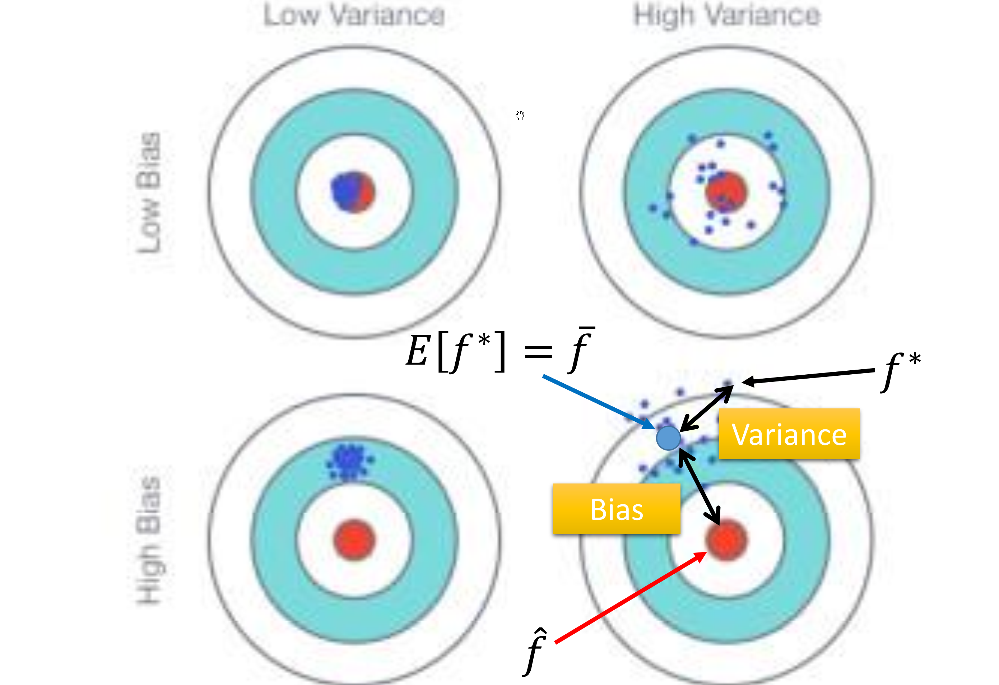
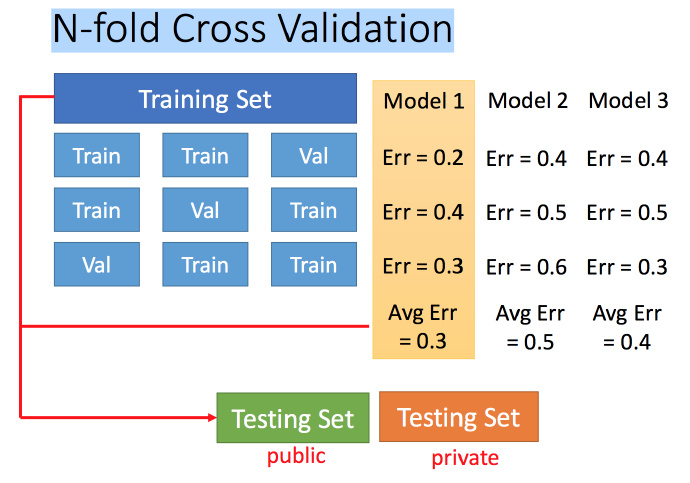

# 偏差与方差

使用的模型往往与真实情况存在一定的误差（error）。误差主要有两个来源：偏差（bias）和方差（Variance）。
偏差类似于预测结果期望与实际结果期望间的距离，方差即类似于预测结果的方差。

## 泛化误差的分解

即使训练集来自同一个分别，算法在不同训练集上学习得到的结果很可能不同。对测试样本x，令$y_D$为x在数据集中的标记，y为x的真实标记（可能存在噪声使 $y_D \neq y$），f(x,D)为在训练集D上得到模型f在x上的预测输出。以回归算法为例，学习算法的期望预测为：
$$ \overline{f}(x) = E_D [f(x;D)] $$
使用样本数相同的不同训练集产生的方差为：
$$ var(x)= = E_D [(f(x;D)-\overline{f}(x))^2] $$
噪声为：
$$ \varepsilon^2 = E_D [(y_D-y)^2] $$
期望输出与真实标记的差别即为偏差：
$$ bias(x) = \overline{f}(x)-y $$

若假设噪声期望值为零，即 $E_D [y_D-y]=0$ ，则算法的期望泛化误差为：
$$
\begin{aligned}
E(f;D) & = E_D[(f(x;D)-y_D)^2] \\
       & = E_D[(f(x;D)-\overline{f}(x)+\overline{f}(x)-y_D)^2]  \\
       & = E_D[(f(x;D)-\overline{f}(x))^2]+E_D[(\overline{f}(x)-y_D)^2]  \\
       & = E_D[(f(x;D)-\overline{f}(x))^2]+E_D[(\overline{f}(x)-y+y-y_D) ^2]  \\
       & = E_D[(f(x;D)-\overline{f}(x))^2]+E_D[(\overline{f}(x)-y)^2]+E_D[(y-y_D) ^2]  \\
       & = bias^2(x) + var(x)+\varepsilon^2
\end{aligned}
$$
即泛化误差可分解为偏差、方差与噪声之和。

## 泛化误差各分量的直观含义

### 偏差

学习算法预测结果期望与实际结果的偏离程度，刻画了模型的拟合效果，算法的学习能力。宛若打靶时实际瞄准点与靶心的差距。主要通过修改模型，增强算法的拟合能力减小。

### 方差

不同数据集下预测结果的变动情况，刻画了扰动对模型的影响，算法的稳定性。若打靶时射手的手抖程度。主要通过增加训练数据集，使其能更全面地包含可能遇到数据的信息。

### 噪声

由数据本身所带来，是任何算法能达到期望泛化误差的下限，刻画了问题本身的难度。

## 偏差-方差窘境（bias-variance dilemma）

当模型的拟合效果不好时，即对数据的变化不敏感，训练数据的扰动不足以使其产生显著变化，此时泛化误差主要由偏差主导，此时为欠拟合。随其拟合效果变强，训练数据中的变化对模型影响越来越大，偏差越来越小，而方差越来越大。当方差大到一定程度即发生过拟合。总误差随模型拟合效果增强，先变小，后变大。

## 模型选择

### 交叉验证

将训练集再分为两部分，一部分作为训练集，一部分作为验证集。用训练集训练模型，然后再验证集上比较，确实出最好的模型之后，再用全部的训练集训练此模型。

#### N-折交叉验证

将训练集分成N份，比如分成3份。比如在三份中训练结果Average错误是模型1最好，再用全部训练集训练模型1。

